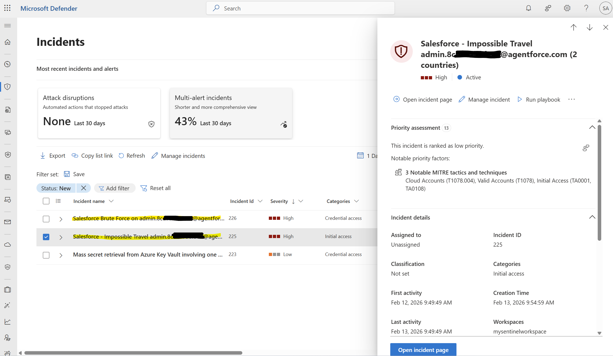

# Salesforce Service Cloud to Microsoft Sentinel - Multi-Environment Integration

## Overview

This solution provides automated ingestion of Salesforce EventLogFile data into Microsoft Sentinel from multiple Salesforce environments. The solution uses Azure Functions with Flex Consumption plan, managed identities, and Data Collection Rules for secure, scalable log collection.

### Key Features

- **Multi-environment support**: Collect logs from multiple Salesforce orgs simultaneously
- **Secure credential management**: Azure Key Vault integration with RBAC
- **Scalable architecture**: Flex Consumption plan with managed identity authentication
- **Centralized logging**: All environments feed into a single Log Analytics table
- **Automated deduplication**: Built-in state management prevents duplicate log ingestion
- **Recovery capability**: Automatically recovers missed logs from the last 3 hours

## Architecture

### Components

| Component | Purpose | Naming Convention |
|-----------|---------|-------------------|
| **Azure Function** | Timer-triggered function (hourly) that queries Salesforce APIs | `func-sf-{uniqueId}` |
| **Key Vault** | Stores Salesforce OAuth credentials per environment | `kv-sf-{uniqueId}` |
| **Storage Account** | Function deployment packages and state tracking table | `stgsf{uniqueId}` |
| **App Service Plan** | Flex Consumption plan for cost-effective scaling | `asp-sf-{uniqueId}` |
| **Data Collection Endpoint** | Shared endpoint for log ingestion | `{workspace}-shared-dce` |
| **Data Collection Rules** | One per environment for data routing | `SalesforceServiceCloud-{env}-DCR` |
| **Log Analytics Table** | Centralized table for all Salesforce events | `SalesforceServiceCloudV2_CL` |
| **Application Insights** | Function monitoring and diagnostics | `appi-sf-{uniqueId}` |


*Figure 1: Architecture Diagram*

### Data Flow

```
Azure Function
    ↓
Key Vault (OAuth credentials)
    ↓
Salesforce EventLogFile API
    ↓
Data Collection Endpoint
    ↓
Data Collection Rules
    ↓
Sentinel Log Analytics Workspace
```

## Prerequisites

### Azure Requirements

- **Azure Subscription** with permissions to create resources
- **Resource Group**
- **Log Analytics Workspace** connected to Microsoft Sentinel
- **Azure Cloud Shell** or local PowerShell with Az module
- **User permissions**:
  - Contributor or Owner on the Resource Group
  - Key Vault Secrets Officer (will be assigned during deployment)

### Salesforce Requirements

For each Salesforce environment, you need:

- **Connected App** configured with:
  - OAuth enabled
  - Client Credentials flow enabled
  - OAuth scopes: `Manage user data via APIs (api)`, `Perform requests at any time (refresh_token, offline_access)`
  - EventLogFile API access
- **Consumer Key**
- **Consumer Secret**

### Deployment Files

Ensure all files are in the same directory:

```
salesforce-connector/
├── Deploy-Function-Solution.ps1
├── salesforce-function-multienv.json
├── Cleanup-SalesforceFunction.ps1
├── function_app.py
├── requirements.txt
└── host.json
```

## Deployment

**We recommend uploading all the files and executing the following commands in the Azure Cloud Shell for a smoother deployment process. This approach removes the requirement to install and maintain the necessary PowerShell modules locally.**

### Step 1: Prepare Environment Configuration

Define your Salesforce environments in PowerShell:

```powershell
$environments = @(
    @{name = "<name>"; salesforceDomain = "<salesforceDomain>"},
    @{name = "<name>"; salesforceDomain = "<salesforceDomain>"}
)
```

**Environment object structure:**
- `name`: Short identifier (3-10 characters, lowercase recommended)
- `salesforceDomain`: Full Salesforce instance URL (no trailing slash)

### Step 2: Deploy Infrastructure

Deploy all Azure resources (Function App, Key Vault, Storage, DCRs):

```powershell
.\Deploy-Function-Solution.ps1 `
    -Mode InfraOnly `
    -ResourceGroupName "<ResourceGroupName>" `
    -WorkspaceName "<WorkspaceName>" `
    -Location "<Location>" `
    -Environments $environments
```

**Parameters:**
- `ResourceGroupName`: Target resource group (must exist)
- `WorkspaceName`: Log Analytics Workspace name
- `Location`: Azure region (e.g., `northeurope`, `eastus`)
- `Environments`: Array of environment configurations from step 1


### Step 3: Grant Yourself Key Vault Permissions

**Via Azure Portal:**
1. Navigate to **Key Vaults** → `kv-sf-{uniqueId}`
2. Select **Access control (IAM)**
3. Click **Add role assignment**
4. Select role: **Key Vault Secrets Officer**
5. Assign to: Your user account (the one used for the previous commands)
6. Click **Review + assign**

### Step 4: Store Salesforce Credentials

Securely store OAuth credentials for each environment:

```powershell
.\Deploy-Function-Solution.ps1 `
    -Mode CredsOnly `
    -ResourceGroupName "<ResourceGroupName>" `
    -WorkspaceName "<WorkspaceName>" `
    -Environments $environments
```

**Interactive prompts** (you will be asked to provide credentials for each environment):
```
━━━━━━━━━━━━━━━━━━━━━━━━━━━━━━━━
prod → https://orgfarm-01e4d1234a-prod-ed.develop.my.salesforce.com
━━━━━━━━━━━━━━━━━━━━━━━━━━━━━━━━
  Consumer Key: ********
  Consumer Secret: ********
  ✅ prod creds stored

━━━━━━━━━━━━━━━━━━━━━━━━━━━━━━━━
dev → https://orgfarm-02e4d5678b-dev-ed.develop.my.salesforce.com
━━━━━━━━━━━━━━━━━━━━━━━━━━━━━━━━
  Consumer Key: ********
  Consumer Secret: ********
  ✅ dev creds stored
```

**Key Vault secrets created:**
- `sf-{env}-clientid`: Salesforce Consumer Key
- `sf-{env}-clientsecret`: Salesforce Consumer Secret

### Step 5: Deploy Function Code

Package and deploy the Python function with remote build:

```powershell
.\Deploy-Function-Solution.ps1 `
    -Mode CodeOnly `
    -ResourceGroupName "<ResourceGroupName>" `
    -WorkspaceName "<WorkspaceName>"
```

**Process:**
1. Validates function files (`function_app.py`, `requirements.txt`, `host.json`)
2. Creates deployment package (ZIP)
3. Uploads to Azure Function
4. Triggers remote build (5-10 minutes)
5. Installs Python dependencies in Azure

## Post-Deployment Verification

### 1. Verify Function Deployment

**Azure Portal:**
- Navigate to **Function App** → `func-sf-{uniqueId}` → **Functions**
- Verify function appears: **SalesforceToSentinel**
- Check status: **Enabled**

### 2. Verify Data Ingestion

**Log Analytics query:**
```kusto
SalesforceServiceCloudV2_CL
| where TimeGenerated > ago(1h)
| summarize 
    Count=count(), 
    LatestEvent=max(TimeGenerated),
    EventTypes=dcount(EventType)
  by EnvironmentName
| order by EnvironmentName asc
```

**Expected result:**
| EnvironmentName | Count | LatestEvent | EventTypes |
|-----------------|-------|-------------|------------|
| prod | 1,234 | 2026-02-19T23:05:00Z | 5 |
| dev | 567 | 2026-02-19T23:06:00Z | 3 |

### 3. Adjust Data Retention

- Navigate to **Log Analytics Workspace** → **Tables** → `SalesforceServiceCloudV2_CL`
- Change the **retention period** to align with your environment (default is 30 days)

## Microsoft Sentinel Analytics Rules

The solution includes three pre-built analytics rules for detecting security threats in your Salesforce environments. These YAML files are located in the `analytic-rules/` folder. You can also develop your own detection rules to tailor threat detection to your specific environment.

| Rule Name | Severity | MITRE ATT&CK | Description |
|-----------|----------|--------------|-------------|
| **Successful Brute Force Login** | High | T1110 (Brute Force) | Detects 10+ failed login attempts followed by a successful login on the same account within 1 hour |
| **Impossible Travel Logins** | High | T1078.004 (Valid Accounts: Cloud) | Identifies logins from 2+ countries within 30 minutes for the same user using GeoIP data |
| **Password Spray Multi-User** | High | T1110.001 (Password Spraying) | Flags single IPs targeting 15+ unique users with failed logins in 5-minute windows |

**Files:**
- `analytic-rules/SalesforceSuccessfulBruteForceLogin.yaml`
- `analytic-rules/SalesforceImpossibleTravelLogins.yaml`
- `analytic-rules/SalesforcePasswordSprayMultiUser.yaml`

These rules leverage the `SalesforceServiceCloudV2_CL` table and provide entity mapping for automated incident enrichment in Microsoft Sentinel.


*Figure 2: incidents in Sentinel*

## Configuration Reference

### Environment Variables (Function App)

Automatically configured during deployment:

| Variable | Description | Example |
|----------|-------------|---------|
| `KEY_VAULT_NAME` | Name of Key Vault for credentials | `kv-sf-sahqikyizk` |
| `DCE_ENDPOINT` | Data Collection Endpoint URL | `https://sentinelws-shared-dce-xxx.westeurope-1.ingest.monitor.azure.com` |
| `STREAM_NAME` | Log Analytics stream name | `Custom-SalesforceServiceCloudV2_CL` |
| `ENVIRONMENTS_JSON` | JSON array of environment configs | `[{"name":"prod","salesforceDomain":"https://...","dcrImmutableId":"dcr-..."}]` |
| `STATE_STORAGE_ACCOUNT` | Storage account for state tracking | `stgsfsahqikyizk` |
| `APPINSIGHTS_INSTRUMENTATIONKEY` | Application Insights key | Auto-populated |

### Timer Schedule

Function runs **every hour** at the top of the hour.

### Log Analytics Table Schema

**Table name:** `SalesforceServiceCloudV2_CL`

| Column | Type | Description |
|--------|------|-------------|
| `TimeGenerated` | datetime | Ingestion timestamp |
| `TimestampDerived` | datetime | Event timestamp from Salesforce |
| `EnvironmentName` | string | Environment identifier (e.g., "prod") |
| `EventType` | string | Salesforce event type (Login, API, ApexExecution, etc.) |
| `RequestId` | string | Salesforce request ID |
| `UserId` | string | Salesforce user ID |
| `UserName` | string | Salesforce username |
| `UniqueLogFileId` | string | Deduplication key (env_eventtype_date_seq) |
| `LogFileSequence` | int | Log file sequence number |
| `JsonData` | dynamic | Full CSV row as JSON object |
| `RawData` | string | Raw CSV row |

## Adding More Environments

To add additional Salesforce environments **after initial deployment**:

### Step 1: Define New Environments

```powershell
$newEnvironments = @(
    @{name = "test"; salesforceDomain = "https://myorgtest.my.salesforce.com"}
)
```

### Step 2: Run AddEnv Mode

```powershell
.\Deploy-Function-Solution.ps1 `
    -Mode AddEnv `
    ResourceGroupName "<ResourceGroupName>" `
    -WorkspaceName "<WorkspaceName>" `
    -KeyVaultName "<KeyVaultName>" `
    -FunctionAppName "<FunctionAppName>" `
    -Environments $newEnvironments
```

## Troubleshooting

### Function Not Appearing After Deployment

**Symptoms:** Functions blade shows "No functions found"

**Solution:**
1. Wait 5-10 minutes for remote build to complete
2. Check deployment logs:
   - **Portal** → **Function App** → **Monitoring** → **Log stream**
3. Look for build errors

### Authentication Errors

**Symptoms:**
```
Failed to retrieve credentials for prod: The user, group or application 'appid=...' does not have secrets get permission
```

**Solution:**
- Verify **Key Vault Secrets Officer** role is assigned to:
  1. Your user account (for manual operations)
  2. Function App managed identity (automatic)

### Salesforce Authentication Fails

**Symptoms:**
```
Salesforce authentication failed for prod: 401 Client Error
```

**Possible causes:**
1. **Invalid credentials**: Verify Consumer Key/Secret in Key Vault
2. **OAuth not enabled**: Check Connected App settings
3. **IP restrictions**: Salesforce org may restrict API access by IP
4. **Wrong domain**: Verify `salesforceDomain` URL is correct

### High Function Execution Cost

**Symptoms:** Unexpectedly high Azure Function costs

**Optimization tips:**
1. **Reduce timer frequency** if hourly is too aggressive:
   ```python
   @app.timer_trigger(schedule="0 0 */2 * * *",  # Every 2 hours
   ```

2. **Adjust instance memory** in ARM template:
   ```json
   "scaleAndConcurrency": {
     "maximumInstanceCount": 100,
     "instanceMemoryMB": 2048  // Reduce to 1024 if needed
   }
   ```

3. **Monitor execution metrics:**
   ```kusto
   requests
   | where timestamp > ago(7d)
   | where cloud_RoleName contains "func-sf"
   | summarize 
       Executions=count(),
       AvgDuration=avg(duration),
       TotalDuration=sum(duration)
     by bin(timestamp, 1h)
   ```

## Cleanup

To completely remove the solution:

```powershell
.\Cleanup-SalesforceFunction.ps1 -ResourceGroupName "<ResourceGroupName>"
```

**What gets deleted:**
- Azure Function and App Service Plan
- Storage Account (including state table)
- Key Vault (soft-deleted)
- Application Insights
- Data Collection Endpoint
- All Data Collection Rules

**What is preserved:**
- Log Analytics Workspace
- Historical data in `SalesforceServiceCloudV2_CL` table
- Resource Group

## Security Best Practices

### 1. Network Security

While this deployment focuses on simplicity and ease of setup, integrating Private Endpoints for core services can be introduced in a future version to improve network isolation and security posture.

### 2. Credential Rotation

Rotate Salesforce credentials periodically:
1. Create new Consumer Key/Secret in Salesforce
2. Update Key Vault secrets

### 3. Monitoring and Alerts

Create alerts for critical failures:

```kusto
// Alert: Function failures
exceptions
| where cloud_RoleName contains "func-sf"
| where timestamp > ago(1h)
| summarize FailureCount=count() by bin(timestamp, 5m)
| where FailureCount > 3

// Alert: No data ingestion
SalesforceServiceCloudV2_CL
| summarize LastIngestion=max(TimeGenerated)
| where LastIngestion < ago(3h)
```

## Common Query Patterns

**Event distribution by environment:**
```kusto
SalesforceServiceCloudV2_CL
| where TimeGenerated > ago(7d)
| summarize Count=count() by EnvironmentName, EventType
| order by EnvironmentName, Count desc
```

**Login anomalies:**
```kusto
SalesforceServiceCloudV2_CL
| where EventType == "Login"
| where TimeGenerated > ago(24h)
| summarize LoginCount=count() by tostring(JsonData.USER_NAME), tostring(JsonData.CLIENT_IP)
| where LoginCount > 100  // Threshold
| order by LoginCount desc
```

**API usage by user:**
```kusto
SalesforceServiceCloudV2_CL
| where EventType == "API"
| where TimeGenerated > ago(24h)
| summarize ApiCalls=count() by UserName, EnvironmentName
| order by ApiCalls desc
```

## Version History

| Version | Date | Changes |
|---------|------|---------|
| 1.0 | 2026-02-12 | Initial release with multi-environment support |

## License

This solution is provided as-is for use with Microsoft Sentinel and Salesforce Service Cloud integration.
